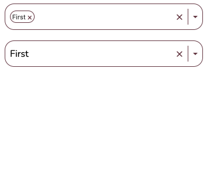
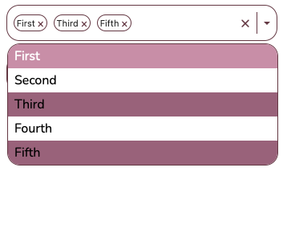
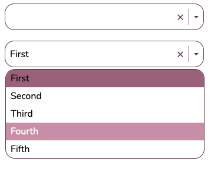

# Project Name

React Selection Components

## Description

This repository showcases my latest React project, where I developed selection components using TypeScript exclusively. The goal of this project was to evolve my skills in the language and create powerful solutions for a fundamental aspect of Front End projects that users encounter in their daily lives.

The project focuses on providing intuitive and efficient selection experiences, and it offers the following key features:

1. **Single Selection Logic**: The code logic implemented allows users to make single selections with clarity and ease. When there is only one option to choose, the user will receive clear indications on how to interact.

2. **Multiple Selection Logic**: In addition to single selections, this project includes the functionality of multiple selection. Users have the freedom to choose multiple options simultaneously, providing a flexible and personalized selection experience.

3. **Keyboard Accessibility**: Accessibility is a crucial aspect, and the selection components have been designed with keyboard accessibility in mind. Users, including those with visual or motor disabilities, can effortlessly interact with the components using the keyboard.

4. **Customizable CSS**: To ensure adaptability to various styles and requirements, the selection components are built with flexible and customizable CSS. This enables easy maintenance and adjustment of component appearance according to specific project demands, resulting in a unique and consistent user experience aligned with the client's visual identity.

I am thrilled with the outcomes achieved in this React project, particularly with the progress I made in TypeScript. I look forward to sharing more details with you. Please feel free to reach out to me if you would like to learn more about the features or if you are interested in collaborating.

## Screenshots
### Selection Components

### Multiple Selection

### Single Selection


## Installation

To use the React selection components in your project, follow these steps:

1. Clone this repository to your local machine.
2. Navigate to the project directory.
3. Install the dependencies by running the following command:
   ```
   npm install
   ```
4. Start using the selection components in your React application.

## Usage

To integrate the selection components into your React application, follow the steps below:

1. Import the necessary components from the package:
   ```jsx
   import { SingleSelection, MultiSelection } from "react-selection-components";
   ```
2. Utilize the components within your React components:
   ```jsx
   function App() {
     return (
       <div>
         <h1>My App</h1>
         <SingleSelection options={...} />
         <MultiSelection options={...} />
       </div>
     );
   }
   ```
3. Customize the CSS styles of the components to match your project's visual identity:
   ```css
   .selection-component {
     /* Custom styles */
   }
   ```

## Contributing

Contributions to this project are welcome! If you would like to contribute, please follow these steps:

1. Fork the repository.
2. Create a new branch for your feature or bug fix.
3. Implement your changes and ensure that the code passes all tests.
4. Commit and push your changes to your forked repository.
5. Open a pull request, providing a detailed description of your changes.

## License

This project is licensed under the [MIT License](LICENSE).

## Deploy

https://typescript-form-ebon.vercel.app

## Contact

If you have any questions or would like to discuss this project further, please feel free to reach out to me. You can contact me via email at [eduvinagre@gmail.com](mailto:eduvinagre@gmail.com) or connect with me on [LinkedIn](https://www.linkedin.com/in/eduvinagre).

Let's evolve together! 🚀
